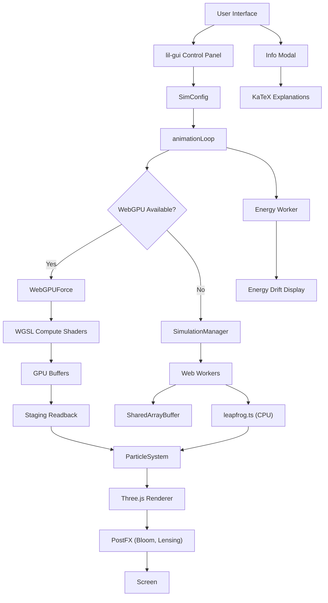
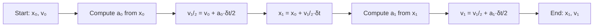
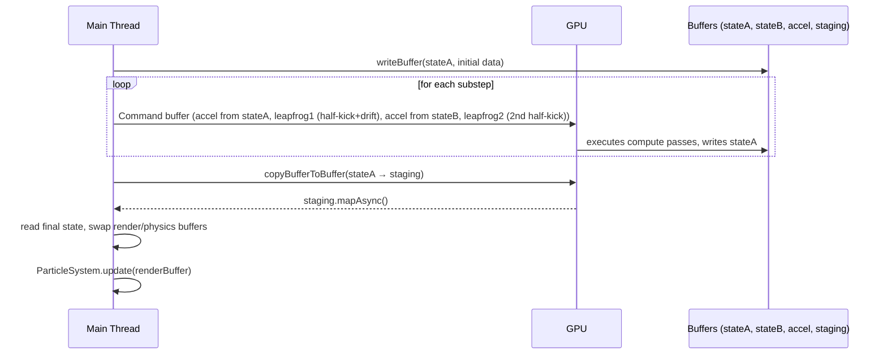
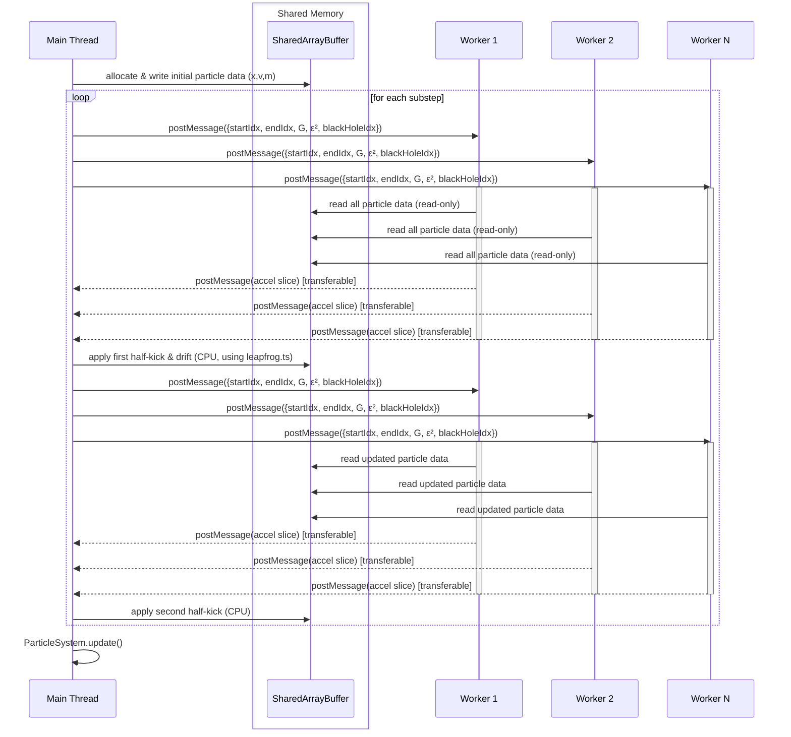

# N‑Body Gravitational Dynamics

A high‑performance N‑body particle simulation implemented in TypeScript, employing **WebGPU compute shaders** for primary acceleration with a multi‑threaded CPU fallback using Web Workers and `SharedArrayBuffer`. The codebase serves as an educational resource for advanced placement physics and calculus, a hardware benchmark, and a demonstration of modern browser capabilities for general‑purpose GPU computing.

---

## Table of Contents

- [Architecture Overview](#architecture-overview)
- [Features](#features)
- [Physics and Numerical Methods](#physics-and-numerical-methods)
    - [Gravitational Force](#gravitational-force)
    - [Integration Scheme](#integration-scheme)
    - [Softening](#softening)
- [Parallel Execution](#parallel-execution)
    - [WebGPU Path](#webgpu-path)
    - [CPU Fallback](#cpu-fallback)
- [Control Parameters](#control-parameters)
- [Energy Drift Monitoring](#energy-drift-monitoring)
- [Project Structure](#project-structure)
- [Installation and Usage](#installation-and-usage)
- [Technology Stack](#technology-stack)
- [License](#license)

---

## Architecture Overview

The simulation is composed of several loosely coupled modules. The following diagram illustrates the data flow and component relationships.



In the **GPU path** (left branch), the entire integration — force evaluation, half‑kick, drift, second half‑kick — runs on the GPU via custom WGSL compute shaders. The CPU only uploads the initial state and reads back the final particle array each frame. In the **CPU fallback** (right branch), Web Workers compute forces and the main thread applies the leapfrog updates using shared functions from `leapfrog.ts`. Particle colour updates and post‑processing are identical for both paths.

---

## Features

- **Exact $\mathcal{O}(N^2)$ direct gravitational force summation** – no tree‑code approximations, ensuring exact force computation for all $N$ bodies.
- **WebGPU acceleration** – a custom WGSL compute shader performs the entire force evaluation and leapfrog integration on the GPU (supported in Chrome, Edge, Safari). All substeps are encoded into a single command buffer, minimising CPU‑GPU synchronisation.
- **CPU fallback** – if WebGPU is unavailable, the simulation uses a pool of Web Workers, each reading the same `SharedArrayBuffer` without copying. A two‑phase synchronisation ensures bit‑identical results.
- **Symplectic leapfrog (Störmer‑Verlet) integration** – a second‑order method that preserves the symplectic form of the Hamiltonian, yielding excellent long‑term energy conservation.
- **Real‑time 3D visualisation** – powered by Three.js with custom GLSL point sprites (diffraction spikes), `UnrealBloomPass` post‑processing, and a procedurally generated black‑hole accretion disk.
- **Gravitational lensing** – a screen‑space post‑processing shader distorts the background near the black hole, with deflection strength proportional to the black‑hole mass.
- **Rotation curve graph** – a small canvas overlay showing binned tangential velocity versus galactocentric radius.
- **Energy drift monitoring** – total mechanical energy is computed asynchronously on a dedicated Web Worker and displayed as a percentage change.
- **Fully interactive controls** – a `lil‑gui` panel provides real‑time adjustment of all physical and rendering parameters, each accompanied by a descriptive tooltip.
- **Multi‑level educational explanations** – content tailored to AP Physics C, AP Physics 1, Calculus BC/AB, algebra, and technical audiences, rendered with KaTeX.

---

## Physics and Numerical Methods

### Gravitational Force

The force between particles $i$ and $j$ follows Newton's law of universal gravitation with a softening length $\varepsilon$:

$$
\vec{F}_{ij} = G\,\frac{m_i m_j}{(r_{ij}^2 + \varepsilon^2)^{3/2}}\;\vec{r}_{ij}
$$

where $\vec{r}_{ij} = \vec{x}_j - \vec{x}_i$, $r_{ij} = \lVert\vec{r}_{ij}\rVert$, $G$ is the gravitational constant, and $\varepsilon$ is the softening parameter. The net force on particle $i$ is the vector sum over all $j \neq i$:

$$
\vec{F}_{\text{net},\,i} = \sum_{j \neq i} \vec{F}_{ij}
$$

Acceleration is then given by $\vec{a}_i = \vec{F}_{\text{net},\,i} / m_i$.

### Integration Scheme

The equations of motion are integrated using the **leapfrog (kick‑drift‑kick)** algorithm. For a substep of duration $\delta t = \Delta t / N_{\text{sub}}$:



In mathematical form:

$$
\begin{aligned}
\vec{v}(t + \tfrac{\delta t}{2}) &= \vec{v}(t) + \vec{a}(t)\,\frac{\delta t}{2} \\[4pt]
\vec{x}(t + \delta t) &= \vec{x}(t) + \vec{v}(t + \tfrac{\delta t}{2})\,\delta t \\[4pt]
\vec{a}(t + \delta t) &\gets \text{computed from } \vec{x}(t + \delta t) \\[4pt]
\vec{v}(t + \delta t) &= \vec{v}(t + \tfrac{\delta t}{2}) + \vec{a}(t + \delta t)\,\frac{\delta t}{2}
\end{aligned}
$$

This method is **symplectic**, meaning it conserves the geometric structure of the Hamiltonian $H = T + U$ over long times, resulting in bounded energy error rather than the unbounded drift typical of non‑symplectic schemes.

### Softening

Without softening ($\varepsilon = 0$), the $r_{ij}^{-2}$ singularity leads to arbitrarily large accelerations during close encounters, violating energy conservation and causing unphysical ejections. The softening length $\varepsilon$ regularises the force at small separations, keeping the integration stable without affecting large‑scale dynamics.

---

## Parallel Execution

The $\mathcal{O}(N^2)$ force evaluation is the computational bottleneck. The simulation employs two distinct strategies, selected automatically based on browser capabilities.

### WebGPU Path



- One thread per particle is launched via `dispatchWorkgroups`.
- The **acceleration shader** uses a uniform buffer containing $G$, $\varepsilon^2$, and the black‑hole index (for selective nucleus interaction). It reads all particle data from a storage buffer and writes accelerations to a second storage buffer.
- Two **leapfrog shaders** perform the half‑kick + drift and the second half‑kick, respectively, reading from one state buffer and writing to another. No CPU involvement is required during the substeps.
- All passes for a full time step are encoded into a single `GPUCommandEncoder`, submitted once per frame, avoiding repeated `mapAsync` waits.
- The final particle state is copied to a **staging buffer** and read back asynchronously.

### CPU Fallback



- A single `SharedArrayBuffer` holds positions, velocities, and masses for all particles.
- Workers receive only the index range they are responsible for; forces are computed locally and returned via transferable objects.
- The two leapfrog phases are **globally synchronized** through message counting, ensuring that all workers use the same coordinate snapshot for each force evaluation.

Both paths produce **bit‑identical accelerations** for the same input configuration; the GPU path simply computes them in parallel and also performs the leapfrog on‑GPU, reducing CPU overhead even further.

---

## Control Parameters

| Parameter | Range | Default | Description |
| :-- | :-- | :-- | :-- |
| **G Constant** | 1.0 – 4.0 | 2.0 | Scales gravitational interaction strength. |
| **Softening $\varepsilon$** | 1.0 – 50.0 | 10.0 | Smoothing length added to distance in the denominator. |
| **Singular Mass** | 5 000 – 500 000 | 150 000 | Mass assigned to the injected black hole. |
| **Time Step $\Delta t$** | 0.005 – 0.05 | 0.016 | Base integration step; smaller $\Delta t$ reduces truncation error. |
| **Sub‑steps per frame** | 1 – 5 | 2 | Number of integration substeps per rendered frame. |
| **Time Scale** | 0.1 – 3.0 | 1.0 | Multiplier for simulation speed (does not affect accuracy). |
| **Point Size** | 2.0 – 6.0 | 4.0 | Rendered star radius, scaled by depth in the vertex shader. |
| **Bloom Intensity** | 0.0 – 3.0 | 1.5 | Strength of the `UnrealBloomPass`; automatically reduced when zoomed far out. |
| **Auto Rotate** | Boolean | true | Enables automatic camera rotation around the galaxy centre. |
| **Particle Count** | 1 000 – 20 000 | 6 000 | Number of simulated bodies; resetting triggers a full reinitialisation. |
| **Pause Simulation** | Boolean | false | Freezes physics updates while permitting camera manipulation. |

---

## Energy Drift Monitoring

Total mechanical energy is computed as:

$$
E_{\text{total}} = \sum_i \frac{1}{2} m_i v_i^2 - \sum_{i < j} G\,\frac{m_i m_j}{\sqrt{r_{ij}^2 + \varepsilon^2}}
$$

This $\mathcal{O}(N^2)$ calculation is offloaded to a dedicated Web Worker so that it never blocks the main thread. The relative drift since the last reset is displayed as a percentage. A well‑tuned leapfrog run with $\varepsilon=10$, $\Delta t=0.016$, and 2 substeps typically exhibits drift below $0.01\%$ per thousand steps.

---

## Project Structure

```
src/
├── math/
│   └── PhysicsEngine.ts            # Galaxy initialisation (positions, velocities, masses)
├── simulation/
│   ├── SimulationManager.ts        # CPU worker pool manager, leapfrog synchronisation
│   ├── physics.worker.ts           # Direct O(N²) force computation (CPU)
│   ├── WebGPUForce.ts              # WebGPU device, pipelines, shaders, readback
│   ├── leapfrog.ts                 # Shared kick‑drift‑kick functions (CPU fallback only)
│   └── energy.worker.ts            # Asynchronous total energy calculation
├── visuals/
│   ├── SceneRenderer.ts            # Three.js scene, camera, OrbitControls
│   ├── ParticleSystem.ts           # Multi‑layer point rendering, star sprites, colour LUTs
│   ├── PostFX.ts                   # Bloom and gravitational lensing post‑processing
│   ├── UIController.ts             # lil‑gui panel with tooltips
│   └── RotCurve.ts                 # Rotation curve canvas overlay
├── script.ts                       # Application entry point
├── style.css                       # Minimal overlay styles
├── ui.ts                           # FPS/energy HUD update, modal/tab logic
├── explanations.ts                 # KaTeX‑rendered educational content
├── simulation.ts                   # Core simulation state, GPU/CPU orchestration
└── vite-env.d.ts                   # TypeScript declarations for CSS imports
```

---

## Installation and Usage

**Requirements:** Node.js ≥ 18, a WebGPU‑enabled browser (Chrome, Edge, Safari) for GPU acceleration. Firefox users will automatically use the multi‑threaded CPU engine.

```bash
git clone https://github.com/richie-rich90454/nbody-sim.git
cd nbody-sim
npm install
npm run dev      # start development server with HMR
npm run build    # production build into dist/
npm run preview  # serve the production build locally
```

Open the provided URL in a browser. Use mouse/trackpad to rotate, zoom, and pan. The lil‑gui panel on the right provides real‑time control over all parameters. The top‑left information button opens a detailed explanation panel with multiple reading levels.

---

## Technology Stack

| Category            | Technology                                                          |
| ------------------- | ------------------------------------------------------------------- |
| Language            | TypeScript 6.0                                                      |
| Build Tool          | Vite 8                                                              |
| GPU Acceleration    | WebGPU (WGSL compute shaders, `dispatchWorkgroups`)                 |
| CPU Parallelism     | Web Workers, `SharedArrayBuffer` (fallback)                         |
| 3D Rendering        | Three.js r184, custom GLSL point sprites                            |
| Post‑Processing     | `postprocessing` (UnrealBloomPass, ShaderPass)                      |
| Color Interpolation | chroma‑js 3.2                                                       |
| Diagrams & Notation | Mermaid 11.14, KaTeX 0.16.45                                        |
| UI Controls         | lil‑gui 0.21                                                        |
| Code Formatting     | Prettier 3.8                                                        |
| Dev Dependencies    | `@webgpu/types`, `@types/three`, `@types/chroma‑js`, `@types/katex` |

---

## License

This project is licensed under the MIT License. See the [LICENSE](LICENSE) file for details.
